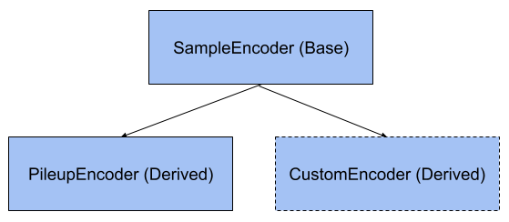

.. VariantWorks SDK documentation master file, created by
   sphinx-quickstart on Mon Jun  1 21:18:58 2020.
   You can adapt this file completely to your liking, but it should at least
   contain the root `toctree` directive.

Core Features
=============


VariantWorks provides most of its functionality in the form of library functions that
encapsulate common algorithms, encodings and utilites helpful for variant processing.
The following sections will walk through an explanation of each feature that is currently
supported.

Encoders
--------

Encoders are classes that generate an encoding for the neural network. The classes can be used to
not only generate encodings, but also augment and transform them.

All encoders need to inherit from the base class :class:`Encoder<variantworks.encoders.Encoder>`
and implement the abstract method `__call__`, which triggers the encoding generation.



Currently available encoders -

* :class:`PileupEncoder<variantworks.encoders.PileupEncoder>` - Encoding read pileups as multi dimensional images.
  **Only SNP encoding is available right now.***
* :class:`BaseEnumEncoder<variantworks.encoders.BaseEnumEncoder>` - An Enum encoder which converts nucleotide base char type to a class number

I/O
---

Format Readers
``````````````

Reading entries from common genomics file formats (such as BAM, VCF) is a precursor to almost all variant calling pipelines.
VariantWorks provides parsing (based on pyVCF) for VCFs, and leverages pySAM for working with BAM files.

The Reader classes follow a similar structure to Encoders when it comes to inheritence. All readers must inherit from
:class:`BaseReader<variantworks.io.baseio.BaseReader>` and implement the abstract methods `__len__` and `__getitem__` to make them
compatible and easy to use with data loaders.

Currently available readers - 

* :class:`VCFReader<variantworks.io.vcfio.VCFReader>` - Reader for VCF compressed and indexed VCF files.
  **VCFReader only support reading single sample VCFs.***


Results Writers
```````````````

After variants have been predicted/evaluated, they are usually required to be output into file formats such as VCF for
downstream processing. VariantWorks provides a :class:`ResultWriter<variantworks.result_writer.ResultWriter>` base class
to facilitate the creation of result writers. Custom writers need to implement only the `write_output` function to be compatible
with the base class.

Currently support result writers -

* :class:`VCFResultWriter<variantworks.result_writer.VCFResultWriter>` class which can output predicted zygosities into a VCF file.


Data Loaders
````````````

Data loaders are core to generating datasets in batches for training a nerual network. Since VariantWorks is based on the
NeMo toolkit, we leverage the data loader abstractions defined in 
`DataLayerNM <https://nvidia.github.io/NeMo/tutorials/custommodules.html#data-layer-module>`_.

Currently available data loaders - 

* :class:`ReadPileupDataLoader<variantworks.dataloader.ReadPileupDataLoader>` - encapsulates loading samples from VCF and using PileupEncoders to generate training data.


Reference Networks
------------------

Reference architectures suitable for variant calling and/or consensus calling are packaged
as part of VariantWorks to quickly bootstrap DL powered variant caling pipelies.

Like the data loaders, reference neural networks are also defined within the NeMo paradigm as
`TrainableNM <https://nvidia.github.io/NeMo/tutorials/custommodules.html#trainable-module>`_ modules.

Currently available networks -

* :class:`AlexNext<variantworks.networks.AlexNet>`

Most customized networks architectures will be added over time.
